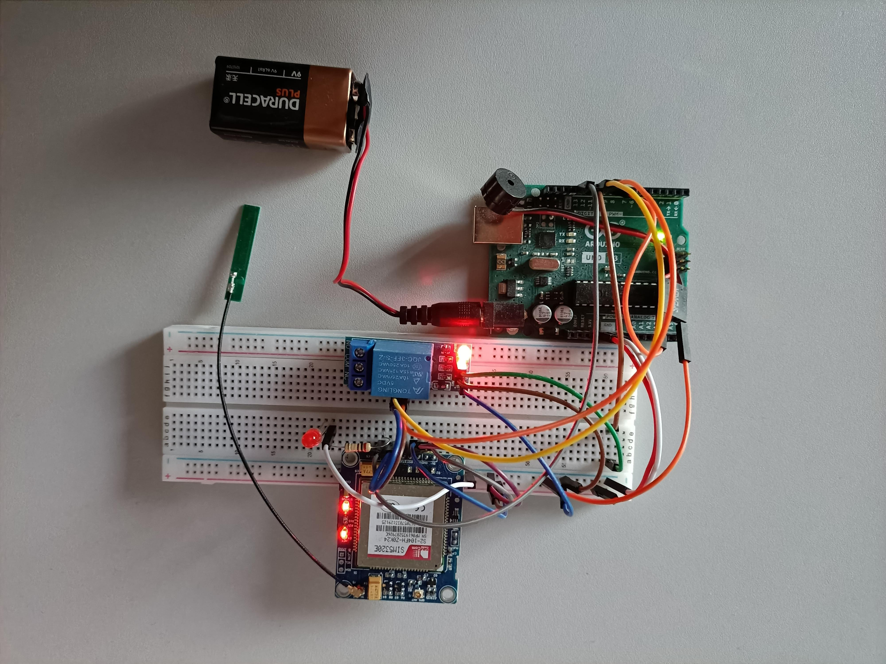
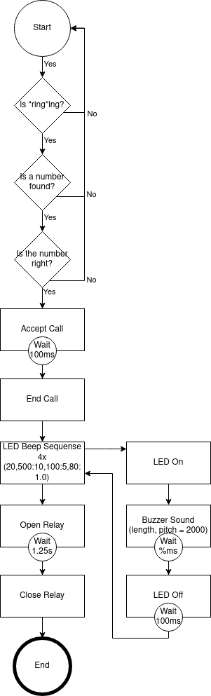

# Remote Phone Trigger

Kleines Fun Projekt. In dem via Anruf, eine kleine Show Sequenz abgearbeitet wird, danach wird ein Relais ausgelöst.

## Signale

| Bauteilname | Device Out | Arduino In |
|-|-|-|
|Buzzer|5V   GND|D9   GND|
|LED|5V (200 Ohm)   GND|D13   GND|
|Relay|5V   Digital   GND|5V   D12   GND|
|Sim5320E|5V   VMCU   TX   RX   GND|5V   5V   D10   D11   GND|

## Ergebnis (arduino)

## Flussdiagramm

## Produkte

Arduino: https://www.conrad.ch/de/p/arduino-board-uno-rev3-dil-core-atmega328-1275279.html \
LED: https://www.digitec.ch/de/s1/product/arduino-uno-atmega328-entwicklungsboard-kit-5764177?supplier=406802 \
200 Ohm Wiederstand: https://www.conrad.ch/de/p/tru-components-metallschicht-widerstand-200-axial-bedrahtet-0207-0-6-w-1-1-st-1557091.html \
Buzzer: https://www.conrad.ch/de/p/buzzermodul-mit-jst-hx254-stecker-lk-buzzer-pcduino-arduino-raspberry-pi-1267837.html \
Relais: https://www.conrad.ch/de/p/makerfactory-mf-6402384-relais-modul-1-st-passend-fuer-entwicklungskits-arduino-2134128.html \
SIM Modul: https://de.aliexpress.com/item/32885664207.html?spm=a2g0s.9042311.0.0.28c44c4dhtOxS9 \
